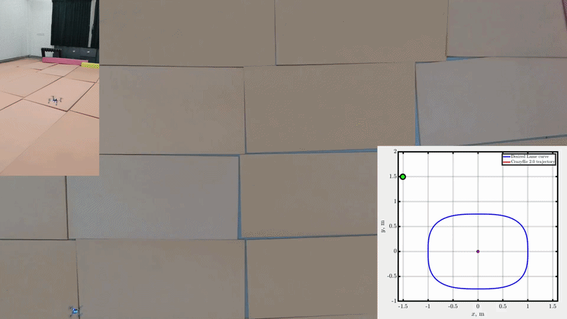

# Surveillance Guidance Using Lamé Curve Paths

This repository contains MATLAB implementations, simulation studies, and experimental validation results associated with the paper:

> Amit Shivam and Ashwini Ratnoo  
> **"Surveillance Guidance Using Lamé Curve Paths"**  
> *Journal of Guidance, Control, and Dynamics (JGCD), 2025*

---

# Overview

This work introduces a curvature-constrained surveillance guidance framework for UAV monitoring of rectangular boundaries using smooth Lamé curve paths.

The proposed method replaces conventional elliptic circumscription with a family of continuous-curvature Lamé curves, providing:

- Reduced surveillance path length
- Improved rectangular boundary approximation
- Feasible curvature-constrained motion
- Smooth vector-field guidance
- Experimental quadrotor validation

---

# Key Contributions

- Continuous-curvature Lamé curve surveillance paths
- Analytical curvature characterization
- Minimal path-length circumscription
- Direct vector-field guidance law
- Lyapunov-based convergence proof
- Crazyflie quadrotor experimental validation

---

## Representative Results

<table>
<tr>
<td align="center" width="50%">

### Lamé Curve Surveillance


Smooth surveillance orbit around a rectangular boundary while respecting UAV turning constraints.

</td>

<td align="center" width="50%">

### Lamé vs Elliptic Circumscription


Comparison between Lamé-curve and elliptic circumscription under identical curvature constraints.

</td>
</tr>
</table>

---


The guidance law combines:

- path tangential motion
- arcsine shaping function
- asymptotic convergence behavior

## Experimental Video Demonstration
Indoor flight experiments using the Crazyflie 2.0 quadrotor validate the proposed guidance strategy at motion capture facility, at AVL IISc.
<table>
<tr>
<td align="center" width="100%">
<h3>Crazyflie Experimental Validation</h3>

<br>
<p>
Indoor Crazyflie 2.0 experimental validation using motion-capture trajectory data for Lamé curve surveillance guidance.
</p>
</td>
</tr>
</table>

---

# Repository Structure

```text
matlab/     -> MATLAB simulation source code
figures/    -> figures and GIF demonstrations
videos/     -> simulation and experiment videos
paper/      -> journal paper and citation